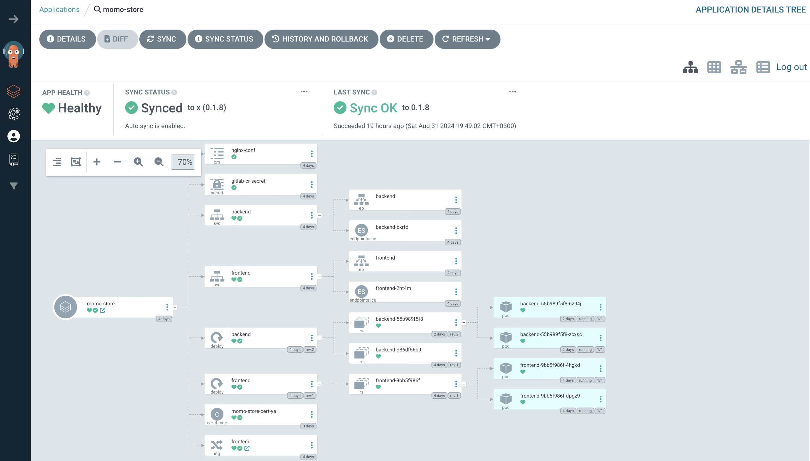
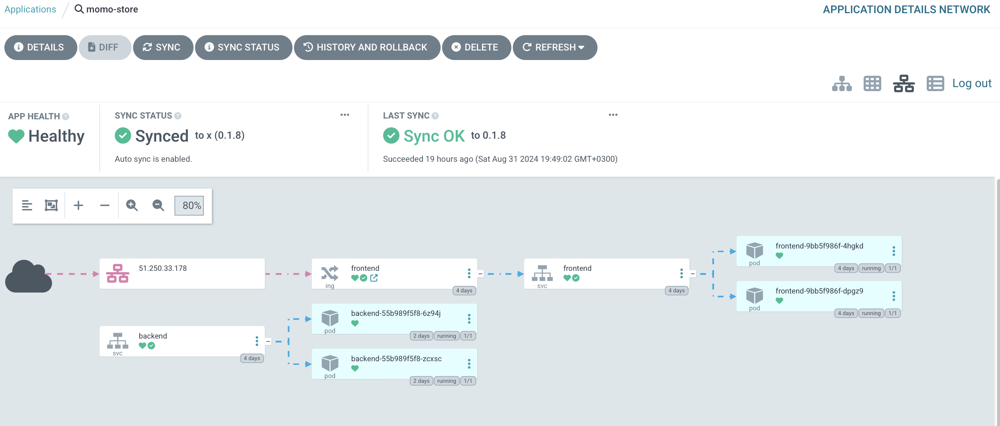
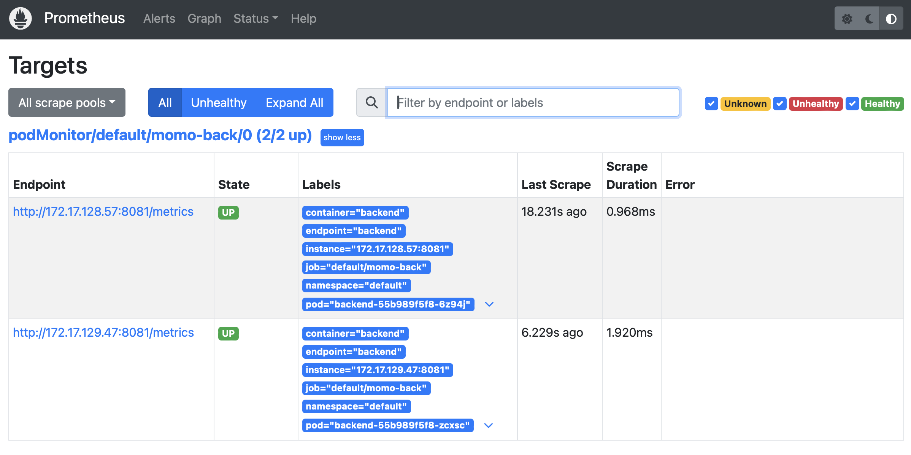
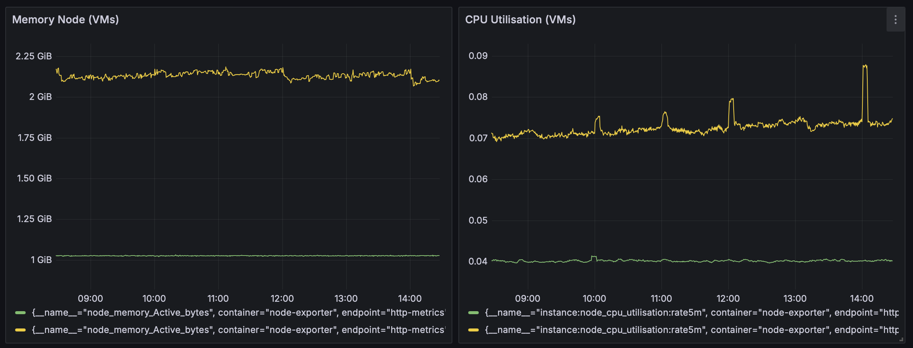
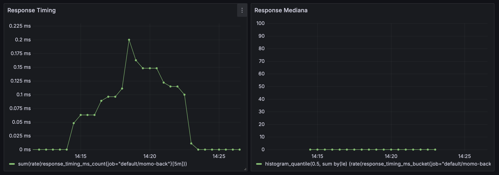

# Momo Store aka Пельменная №2

## Сайт: https://momo-store-ru.ru


## Об устройстве репозитория
`backend` - код для бэкенда приложения. \
`frontend` - код для фронтенда приложения.
`infrastructure` - код инфраструктуры кластера кубернетис в формате терраформ. \
`kubernetes` - минифесты сервисов в формате yaml для ручного запуска приложения в кластере кубернетиса. \
`momo-store-chart` - код helm chart приложения. \
`monitoring` - конфиг для установки и настройки хелм чарта kube-prometheus-stack для сервисов Prometheus и Grafana.

## Установка
Приложение устанавливается в кубернетес кластере при помощи `helm`:
1. Скачать пакет приложения нужной версии по ссылке: [helm-momo-store](https://nexus.praktikum-services.tech/service/rest/repository/browse/momo-store-helm-maksim-kazanov/momo-store/) или подключить репозиторий helm:
```bash
    helm repo add momo-store-nexus \
    http://nexus.praktikum-services.tech/repository/momo-store-helm-maksim-kazanov/ \
    --username <you_login> --password <you_password> && helm repo update
```
2. Развернуть приложение в кластере кубернетис:
```bash
    helm upgrade --install momo-store \
    --set frontend.fqdn=<your fqdn> \
    --set CR_SECRET=<GitLab CR .dockerconfigjson base64> \
    --atomic --timeout 10m \
    momo-store-nexus/momo-store -n default
```
## Деплой инфраструктуры
Кластер кубернетиса разворачивается по методу IaC `Terrarorm` в Yandec Cloud (yc). В кластере запускаются две ноды для обеспечения минимальной отказоустойчивости. Код инфраструктуры подключает модули yc для настройки VPC и Managed Service for Kubernetes сервисов, что уменьшает обЪем кода. Хранение стейта терраформа выполнено в бакете yc Object Storage и Managed Service for YDB (state locking).
Для запуска терраформа выполнить:
```bash
     terraform init
     terraform validate
     terraform plan -out="plan-iac"
     terraform apply -auto-approve "plan-iac"
```
Для изменения параметров инфраструктуры и кластера кубернетис отредактировать файл `main.tf` в папке 
`infrastructure`.

## Версиорирование и релизный цикл приложения
Версионирование осуществляется путем добавления переменной `VERSION:1.0.${CI_PIPELINE_ID}` к тэгам docker образов. Новая версия образа контейнера бэка и фронта собирается при внесении изменений в код соответствующих обЪектов c помощью пайплайна GitLab CI/CD автоматически. Контейнеры хранятся в GitLab container registry, которые используются для деплоя микросервисов в кубернетис кластере.

## Дополнительные онлайн-сервисы приложения
### Argo
Сайт: https://argocd.momo-store-ru.ru \
Login: admin
Passw: UnCHR9eC5SLlyLMm





### Prometheus
Сайт: https://prometheus.momo-store-ru.ru




### Grafana
Сайт: https://grafana.momo-store-ru.ru \
Login: admin
Passw: prom-operator1

Dashboard CUSTOM Node health \
 \

Dashboard MOMO-store App Metrics


## Frontend

```bash
npm install
NODE_ENV=production VUE_APP_API_URL=http://localhost:8081 npm run serve
```

## Backend

```bash
go run ./cmd/api
go test -v ./... 
```
